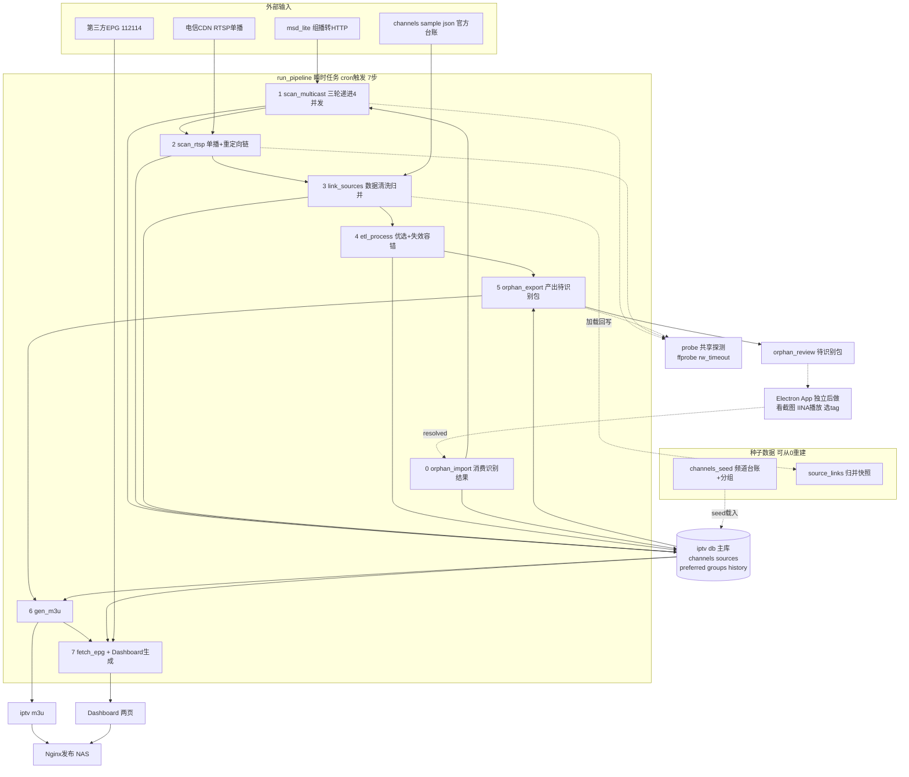
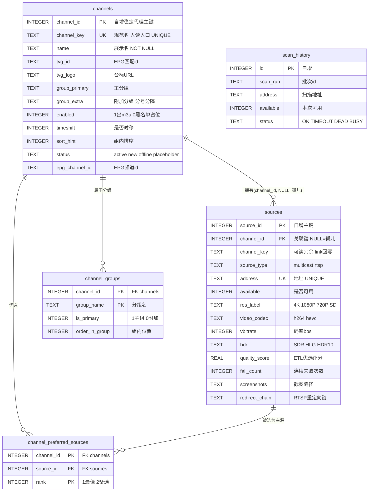

# 架构总览 (ARCHITECTURE)

> 创建: 2026-07-24
> 本文档描述 **当前实现** 的权威架构(与代码对齐)。
> 演进历史见 REFACTOR_DESIGN.md;本文档是最新实现的总览。

---

## 一、设计理念

**三层解耦 + 瞬时任务 + 异步文件交换**

```
采集(scan) → SQLite主库 → 加工(清洗/ETL) → 生成(m3u+Dashboard) → 发布(Nginx)
```

- **SQLite (data/iptv.db) 是唯一主数据源**。所有环节读写它,不存中间态散文件。
- **pipeline 是瞬时任务**: cron 触发 → 执行 → 退出,不常驻、不占资源。
- **人工干预异步化**: 孤儿源识别通过 json 文件交换(pipeline产出待识别包 ↔ Electron App人工识别),无常驻后端。
- **可从0重建**: 种子数据(channels_seed.json + source_links.json)让别人 clone 后能重建整库。

---

## 二、整体架构图



---

## 三、模块清单 (src/)

### 流水线脚本 (run_pipeline.sh 按序调用)
| 步 | 脚本 | 层 | 职责 | 读 | 写 |
|----|------|----|----|----|----|
| 0 | orphan_import.py | 消费 | 读App识别结果,孤儿源写库归并 | orphan_inbox/*.json | sources, channels, source_links.json |
| 1 | scan_multicast.py | 采集 | 组播扫描(三轮递进/双模式) | msd_lite | sources, scan_history |
| 2 | scan_rtsp.py | 采集 | 单播扫描+重定向链追踪 | CDN, channels.json | sources, scan_history |
| 3 | link_sources.py | 清洗 | 源归并到频道(channel_id+key冗余) | channels.json, source_links.json | sources.channel_id/key, source_links.json |
| 4 | etl_process.py | 加工 | 源优选(失效容错)+下线检测 | sources | channel_preferred_sources, channels.status |
| 5 | orphan_export.py | 产出 | 剩余孤儿源→待识别包 | sources, channels | orphan_review/ |
| 6 | gen_m3u.py | 生成 | 出 m3u(只出可用/临时失效源) | channels+优选表 | iptv.m3u |
| 7 | fetch_epg.py / gen_dashboard.py / gen_channels_page.py | 生成 | EPG+两个Dashboard页 | DB + 第三方EPG | epg_today.json, dashboard/*.html |

### 共享/工具脚本 (不在pipeline)
| 脚本 | 用途 |
|------|------|
| probe.py | 共享探测模块(ffprobe带-rw_timeout防卡死/截图/重定向追踪),被scan_*和orphan_export复用 |
| db_schema.py | 权威建库schema(从0建库) |
| seed.py | 种子导出/载入(channels_seed.json),配合从0重建 |
| migrate_v2.py | 一次性schema重构(已跑完,保留备查) |
| bench_concurrency.py | 并发压测工具(一次性调优用) |

---

## 四、数据模型 (SQLite iptv.db,唯一主数据源)

> 权威 schema 在 `src/db_schema.py`;设计理念详见 CHANNEL_KEY_DESIGN.md V2。

### 4.1 ER 图



### 4.2 表职责与关键设计

| 表 | 职责 | 关键设计 |
|----|------|---------|
| **channels** | 频道元数据台账 | **只增不删**(metadata风格,无源可用也保留,标offline);不含优选源(拆到独立表) |
| **sources** | 采集到的播放源清单 | 扫描到就写;**进表≠已识别**(channel_id=NULL即孤儿);两列关联(id稳+key可读) |
| **channel_preferred_sources** | 优选关系(ETL产出) | 从channels拆出(优选是易变加工结果);带rank支持一频道多源按画质排 |
| **channel_groups** | 频道-分组关联(多对多,保序) | 一频道可属多组(主组+附加组);order_in_group保m3u顺序 |
| **scan_history** | 扫描历史 | 每次扫描留痕,趋势/变更分析 |

### 4.3 主键与外键(核心设计)

- **主键用稳定代理键 channel_id(自增整数),不用业务名**。铁律:频道改名(别名归并/规范化)时
  channel_id 不变,关联不断。若用 channel_key(会变的名字)作外键,改名会断关联(曾踩坑:悬空key)。
- **channel_key(规范名) 加 UNIQUE 约束**,作人读/沟通/台标匹配入口,但不作主键。
  → 一句话: **channel_key 给人看,channel_id 给机器关联**。
- **sources 两列都留**: `channel_id`(整数外键,关联稳定) + `channel_key`(可读冗余,link_sources回写,
  `SELECT * FROM sources` 一眼看懂是哪个台)。冗余的一致性由 link_sources 每次重跑统一回写保证。

### 4.4 约束清单

| 约束 | 表.列 | 作用 |
|------|-------|------|
| PRIMARY KEY | channels.channel_id (AUTOINCREMENT) | 稳定代理主键 |
| UNIQUE | channels.channel_key | 规范名不重复,防悬空 |
| NOT NULL | channels.name | 频道必须有展示名 |
| PRIMARY KEY | sources.source_id (AUTOINCREMENT) | 源主键 |
| UNIQUE | sources.address | 一个地址只一条源 |
| FK | sources.channel_id → channels.channel_id | 源归属频道(NULL=孤儿) |
| PRIMARY KEY | channel_preferred_sources(channel_id, rank) | 一频道每个rank一条 |
| FK | channel_preferred_sources.channel_id/source_id | 优选引用频道和源 |
| PRIMARY KEY | channel_groups(channel_id, group_name) | 频道在一个组内唯一 |
| FK | channel_groups.channel_id → channels.channel_id | 分组归属频道 |

### 4.5 索引
- `idx_channels_group(group_primary)` `idx_channels_key(channel_key)`
- `idx_sources_channel(channel_id)` `idx_sources_type(source_type)` `idx_sources_avail(available)`
- `idx_history_run(scan_run)`

### 4.6 特殊数据
- **占位频道**: channel_key=`__UNKNOWN__`(未知待查) / `__JUNK__`(垃圾/测试流),enabled=0,status=placeholder。
  未知/垃圾流(百视通BesTV那种"能播但不对应真频道")集中挂靠,不进m3u。
- **status 取值**: active(正常) / new(待识别) / offline(源全失效仍保留) / placeholder(占位频道)。

### 4.7 从0重建路径
```
db_schema.py 建表 → seed.py load(载入channels_seed.json:频道台账+分组)
  → scan(填sources技术属性) → link_sources(加载source_links.json快照归并)
  → etl(优选) → gen(m3u+dashboard)
```
种子(channels_seed.json + source_links.json)可分享,别人 clone 后能重建整库。

---

## 五、关键机制

### 扫描(scan_multicast, 详见 REFACTOR_DESIGN 5.6.5/5.6.6)
- **双模式**: `--mode known`(增量,仅已知源,每周cron,~11分钟) / `--mode full`(全量768段,发现新频道,每月,~17分钟)
- **三轮递进**: (4并发,12s) → (2并发,15s) → (1并发,18s)。降并发+超时递增,治误报。
- **零误报关键**: ①probe加-rw_timeout防ffprobe卡死 ②J1900甜点4并发 ③未知空地址不进重试轮

### 归并(link_sources)
优先级: source_links.json快照(人工) > channels.json官方 > NAME_OVERRIDES别名 > 归一化名。回写channel_id+channel_key冗余,更新快照。

### 失效容错(etl_process, gen_m3u)
- fail_count=连续失败次数。可用 或 fail_count<阈值(临时失效,可能误报)→ 保留主源、进m3u。
- 全部源fail_count>=阈值(真失效)→ 不选主源、移出m3u(避免僵尸频道)。

### 孤儿源识别(异步文件交换, 详见 ORPHAN_REVIEW.md)
pipeline产出orphans.json+截图 → Electron App人工识别 → resolved.json → pipeline消费写库。json契约定死,三方解耦。

### 单播/回看机制(2026-07-24 实测定论)
- **单播/回看能否播 = ①token没过期(按签发时间) + ②到EPG/CDN专网路由通**,两者缺一不可。组播(233.50.x走IGMP直连)不依赖这两点,最稳。
- **CDN不校验token里绑的IP**: token的accountinfo明文记录认证时IP,但实测旧token(绑旧IP)换IP后照样播直播+回看 → 换IP无需重刷token,只要路由在。
- **换IP后单播全挂的真凶=hotplug路由脚本被冲**: 换IP触发完整ifup,netifd重建接口路由时冲掉EPG/CDN专网路由(race condition),导致单播全挂(组播正常)。非token问题。
- **修复**: `reference/router/99-iptv-routes`(部署软路由 /etc/hotplug.d/iface/),加专网路由后循环校验约30s,被netifd冲掉就重加;网关全动态探测无硬编码。
- **决策**: m3u主源坚持组播(换IP无影响)。单播回看m3u支持已rollback(天生脆弱,依赖路由+token)。probe_timeshift(回看天数探测)+fetch_channels(EPG认证刷token,软路由跑需`--ip <IPTV内网IP>`+路由通)保留为备用工具,token按签发时间低频刷即可。

---

## 六、部署 (待实施)

- NAS Docker Compose: pipeline瞬时任务容器 + Nginx发布容器(现有)
- 群晖cron: 每周known增量 + 每月full全量
- 真实配置在 .env(gitignore); .env.example 为模板
